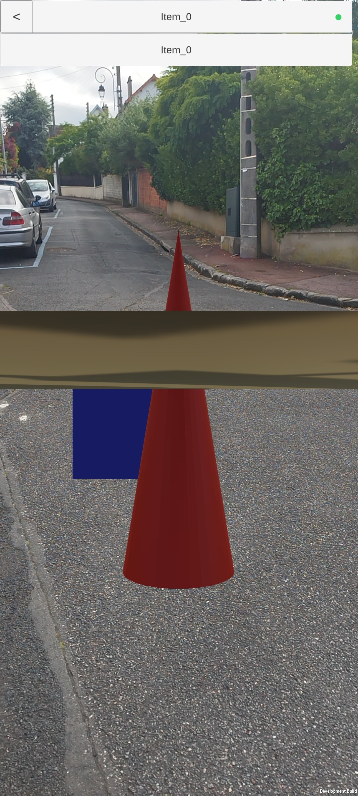

## anchorTest_app_n

### Summary
sample glTF scene demonstrating anchoring using MPEG_anchor at the node level using TRACKABLE_APPLICATION.

### Extensions used

- MPEG_anchor

### Screeshot

### Legal

&#169; 2023, Interdigital, <a alt="license" href="https://www.5g-mag.com/license">5G MAG</a>

  - Faivre d'Arcier Etienne for Everything

## anchorTest_app_s

### Summary
demonstrates anchoring using MPEG_anchor at the scene level using TRACKABLE_APPLICATION.

### Extensions used

- MPEG_anchor

### Screeshot

### Legal

&#169; 2023, Interdigital, <a alt="license" href="https://www.5g-mag.com/license">5G MAG</a>

  - Faivre d'Arcier Etienne for Everything

## anchorTest_ctrl_n

### Summary
demonstrates anchoring using MPEG_anchor at the node level using TRACKABLE_CONTROLLER.

### Extensions used

- MPEG_anchor

### Screeshot

### Legal

&#169; 2023, Interdigital, <a alt="license" href="https://www.5g-mag.com/license">5G MAG</a>

  - Faivre d'Arcier Etienne for Everything

## anchorTest_app_s

### Summary
demonstrates anchoring using MPEG_anchor at the scene level using TRACKABLE_CONTROLLER.

### Extensions used

- MPEG_anchor

### Screeshot

### Legal

&#169; 2023, Interdigital, <a alt="license" href="https://www.5g-mag.com/license">5G MAG</a>

  - Faivre d'Arcier Etienne for Everything

## anchorTest_floor_n

### Summary
Demonstrates AR anchoring of a node using TRACKABLE_FLOOR. The 'Cone' node position depends on the detected floor, while the rest of the scene's position is relative to the XR space origin.

### Extensions used

- MPEG_anchor

### Screeshot

### Legal

&#169; 2023, Interdigital, <a alt="license" href="https://www.5g-mag.com/license">5G MAG</a>

  - Faivre d'Arcier Etienne for Everything

## anchorTest_floor_n_a

### Summary
demonstrates anchoring using MPEG_anchor at the node level using TRACKABLE_FLOOR with 2 nodes.

### Extensions used

- MPEG_anchor

### Screeshot

### Legal

&#169; 2023, Interdigital, <a alt="license" href="https://www.5g-mag.com/license">5G MAG</a>

  - Faivre d'Arcier Etienne for Everything

## anchorTest_floor_s

### Summary
Demonstrates AR anchoring of a node using TRACKABLE_FLOOR. The whole scene is anchored to the floor.

### Extensions used

- MPEG_anchor

### Screeshot

### Legal

&#169; 2023, Interdigital, <a alt="license" href="https://www.5g-mag.com/license">5G MAG</a>

  - Faivre d'Arcier Etienne for Everything

## anchorTest_geom_n

### Summary
demonstrates anchoring using MPEG_anchor at the node level using TRACKABLE_GEOMETRY.

### Extensions used

- MPEG_anchor

### Screeshot

### Legal

&#169; 2023, Interdigital, <a alt="license" href="https://www.5g-mag.com/license">5G MAG</a>

  - Faivre d'Arcier Etienne for Everything

## anchorTest_geom_s

### Summary
demonstrates anchoring using MPEG_anchor at the scene level using TRACKABLE_GEOMETRY.

### Extensions used

- MPEG_anchor

### Screeshot

### Legal

&#169; 2023, Interdigital, <a alt="license" href="https://www.5g-mag.com/license">5G MAG</a>

  - Faivre d'Arcier Etienne for Everything

## anchorTest_geoSpatial_n_cs

### Summary
demonstrates anchoring using MPEG_anchor at the node level using TRACKABLE_MARKER_GEO.

### Extensions used

- MPEG_anchor

### Screeshot

### Legal

&#169; 2023, Interdigital, <a alt="license" href="https://www.5g-mag.com/license">5G MAG</a>

  - Faivre d'Arcier Etienne for Everything

## anchorTest_geoSpatial_s_cs

### Summary
demonstrates anchoring using MPEG_anchor at the scene level using TRACKABLE_MARKER_GEO.

### Extensions used

- MPEG_anchor

### Screeshot

### Legal

&#169; 2023, Interdigital, <a alt="license" href="https://www.5g-mag.com/license">5G MAG</a>

  - Faivre d'Arcier Etienne for Everything

## anchorTest_m2D_n

### Summary
Demonstrates anchoring a node TRACKABLE_MARKER_2D.
The file `textures/metro_box.png` is the marker and should be printed on a sheet of paper, or displaid on a screen.
When loading the scene only a plane is displaid. The red 'Cone' displays when the marker is detected, and its position is anchored to the marker.

### Extensions used

- MPEG_anchor

### Screeshot

### Legal

&#169; 2023, Interdigital, <a alt="license" href="https://www.5g-mag.com/license">5G MAG</a>

  - Faivre d'Arcier Etienne for Everything

## anchorTest_m2D_s

### Summary
Demonstrates anchoring a whole scene using TRACKABLE_MARKER_2D.
The file `textures/metro_box.png` is the marker and should be printed on a sheet of paper, or displaid on a screen.
When loading the scene, nothing is displaid until the marker is detected, then the scene remains anchored to the marker as the viewer moves around.

### Extensions used

- MPEG_anchor

### Screeshot

### Legal

&#169; 2023, Interdigital, <a alt="license" href="https://www.5g-mag.com/license">5G MAG</a>

  - Faivre d'Arcier Etienne for Everything

## anchorTest_m3D_n

### Summary
(not implemented) anchoring using MPEG_anchor at the node level using TRACKABLE_MARKER_3D.

### Extensions used

- MPEG_anchor

### Screeshot

### Legal

&#169; 2023, Interdigital, <a alt="license" href="https://www.5g-mag.com/license">5G MAG</a>

  - Faivre d'Arcier Etienne for Everything

## anchorTest_m3D_s

### Summary
(not implemented) anchoring using MPEG_anchor at the node level using TRACKABLE_MARKER_3D.

### Extensions used

- MPEG_anchor

### Screeshot

### Legal

&#169; 2023, Interdigital, <a alt="license" href="https://www.5g-mag.com/license">5G MAG</a>

  - Faivre d'Arcier Etienne for Everything

## anchorTest_viewer_n

### Summary
Demonstrates AR anchoring of a node using TRACKABLE_VIEWER. The anchored node consists of the cone and cube meshes, which remain locked in front of the viewer when moving, while the rest of the scene (the textured plane) remains anchored to its original position in the real world. 

### Extensions used

- MPEG_anchor

### Screeshot

### Legal

&#169; 2023, Interdigital, <a alt="license" href="https://www.5g-mag.com/license">5G MAG</a>

  - Faivre d'Arcier Etienne for Everything

## anchorTest_viewer_s

### Summary
Demonstrates AR anchoring a **scene** using TRACKABLE_VIEWER. The whole scene is anchored to the viewer, making it appear staticaly in the middle of the screen as the viewer moves around.

### Extensions used

- MPEG_anchor

### Screeshot

### Legal

&#169; 2023, Interdigital, <a alt="license" href="https://www.5g-mag.com/license">5G MAG</a>

  - Faivre d'Arcier Etienne for Everything
