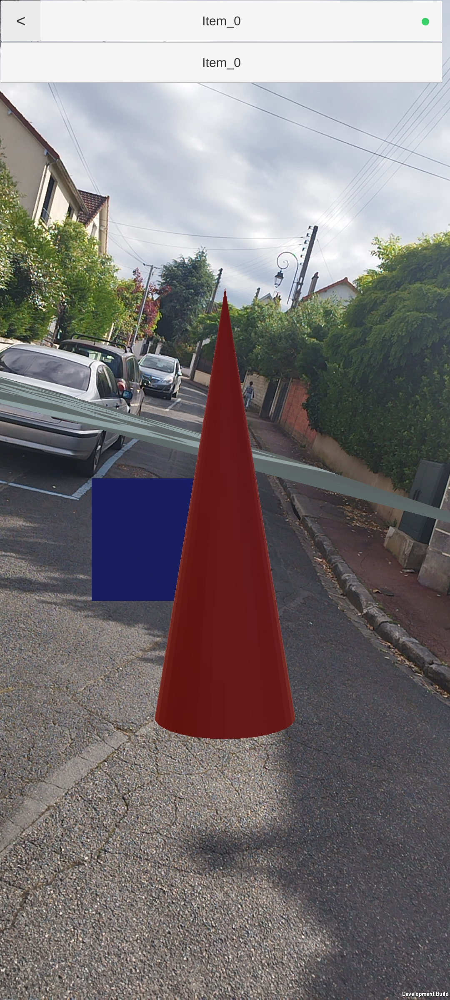

# Test content for the XR Unity Player
This repository provides test content for the XR Player.

Additional information can be found at: https://5g-mag.github.io/Getting-Started/pages/xr-media-integration-in-5g/

# Available content

See individual directories for detailed information.

## Reference assets for testing

### Assets to testing INTERACTIVITY

<table>
<tr>
<th>Asset</th>
<th>Directory</th>
</tr>
<tr>
<td width="400px">

</td>
<td>
Click <a href="geometry"><b>here</a></b> to access the directory which contains <b>solid geometries</b> and variants 
</td>
<tr>
</table>

### Assets to testing ANCHORING

<table>
<tr>
<th>Asset</th>
<th>Directory</th>
</tr>
<tr>
<td width="200px">

</td>
<td>
Click <a href="anchoring"><b>here</a></b> to access the directory which contains <b>solid geometries</b> and variants 
</td>
<tr>
</table>

### Assets to testing MEDIA

<table>
<tr>
<th>Asset</th>
<th>Directory</th>
</tr>
<tr>
<td width="400px">

</td>
<td>
Click <a href="TV"><b>here</a></b> to access the directory which contains <b>a model of a TV set</b> 
</td>
<tr>
<tr>
<td width="400px">

</td>
<td>
Click <a href="video"><b>here</a></b> to access the directory which contains models to <b>integrate audiovisual textures</b> 
</td>
<tr>
</table>

# Questions or Comments

If you have any questions, please submit an issue.
